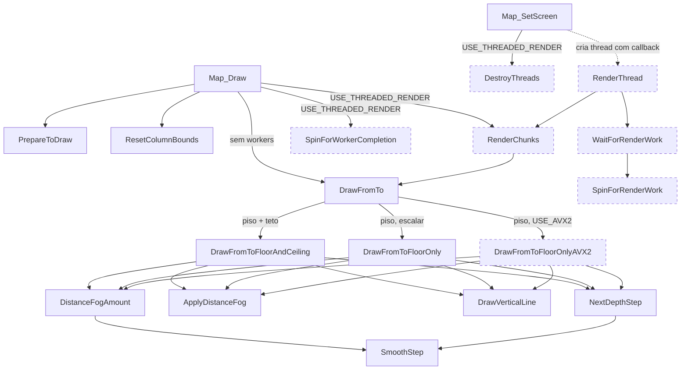

# Call graph do VoxelSpaceSDL

Este documento representa as chamadas entre as funções do projeto. Chamadas para a
SDL, para a biblioteca C e intrínsecos AVX2 foram omitidos para manter o diagrama
legível.

Legenda:

- seta contínua: chamada direta;
- seta tracejada: chamada indireta, via listener/callback ou thread;
- nó tracejado: caminho habilitado somente por uma opção de compilação.

## Fluxo principal

```mermaid
flowchart TD
    main["main"] --> parse["CommandArgs_Parse"]
    parse --> testArg["TestArg"]
    parse --> showHelp["ShowHelp"]

    main --> addListener["Engine_AddListener"]
    main --> engineStart["Engine_Start"]
    engineStart --> compareSDL["CompareSDLVersions"]
    engineStart --> spawnScreen["SpawnScreen"]
    engineStart --> mapOpenDual["Map_OpenDual"]
    engineStart --> callListeners["Engine_CallListeners"]

    spawnScreen --> mapSetScreen["Map_SetScreen"]
    mapOpenDual --> loadLayer["LoadLayer"]
    loadLayer --> reencode["ReencodeSurface"]
    loadLayer --> scale["ScaleSurface"]
    loadLayer --> freeLayer["FreeLayerData"]
    mapOpenDual --> mapClose["Map_Close"]

    main --> engineUpdate["Engine_Update"]
    engineUpdate --> spawnScreen
    engineUpdate --> callListeners
    engineUpdate --> benchmark["UpdateBenchmarkCamera"]
    engineUpdate --> mapDraw["Map_Draw"]
    engineUpdate --> fps["DrawFPSCounter"]
    fps --> charWidth["SevenSegCharWidth"]
    fps --> drawChar["DrawSevenSegChar"]
    drawChar --> charWidth
    drawChar --> segMask["SevenSegMaskForChar"]
    drawChar --> drawMask["DrawSevenSegMask"]

    main --> callListeners
    main --> engineEnd["Engine_End"]
    engineEnd --> mapSetScreen
    engineEnd --> mapClose

    callListeners -. "listener registrado" .-> inputStart["Input_Start"]
    callListeners -. "listener registrado" .-> inputUpdate["Input_Update"]
    callListeners -. "listener registrado" .-> inputEvent["Input_Event"]
    callListeners -. "desktop" .-> dndWindow["DND_Window"]
    callListeners -. "desktop" .-> dndEvent["DND_Event"]
    callListeners -. "USE_SDL_TTF" .-> overlayInit["Overlay_Init"]
    callListeners -. "USE_SDL_TTF" .-> overlayUpdate["Overlay_Update"]
    callListeners -. "USE_SDL_TTF" .-> overlayDraw["Overlay_Draw"]
    callListeners -. "controle conectado" .-> logAdd["main.c: AddController"]
    callListeners -. "falha no controle" .-> logFail["main.c: FailController"]
    callListeners -. "controle removido" .-> logRemove["main.c: RemoveController"]

    classDef optional stroke-dasharray: 5 5;
    class dndWindow,dndEvent,overlayInit,overlayUpdate,overlayDraw optional;
```

No build para Emscripten, `Engine_Update` é entregue a
`emscripten_set_main_loop`; no build desktop, `main` o chama em um laço.

## Entrada, câmera e callbacks

`input/kbmouse.c` e `input/gamepad.c` são incluídos por `input.c`, portanto suas
funções `static` fazem parte da mesma unidade de tradução.

```mermaid
flowchart TD
    inputStart["Input_Start"] --> getObjects["Engine_GetObjects"]
    inputStart --> getHeight["Map_GetHeight (inline)"]
    inputStart --> resetPitch["Camera_ResetPitch (inline)"]
    inputStart --> mouseGrab["SetMouseGrab"]

    inputUpdate["Input_Update"] --> getObjects
    inputUpdate --> pollControllers["PollControllers"]
    inputUpdate --> keyboard["ProcessKeyboard"]
    inputUpdate --> getHeight

    pollControllers --> pollController["PollController"]
    pollController --> buttonDown["ProcessControllerButtonDown"]
    pollController --> buttonHold["ProcessControllerButtonHold"]
    pollController --> move["Camera_MoveForward (inline)"]
    pollController --> strafe["Camera_StrafeHoriz (inline)"]
    pollController --> rotate["Camera_Rotate (inline)"]
    pollController --> pitch["Camera_Pitch (inline)"]
    buttonDown --> engineStop["Engine_Stop"]
    buttonDown --> resetDistance["Camera_ResetDistance (inline)"]
    buttonDown --> adjustDistance["Camera_AdjustDistance (inline)"]
    buttonDown --> resetPitch
    buttonHold --> strafe

    keyboard --> move
    keyboard --> strafe
    keyboard --> pitch

    inputEvent["Input_Event"] --> padAdd["gamepad.c: AddController"]
    inputEvent --> padRemove["gamepad.c: RemoveController"]
    inputEvent --> keyDown["ProcessKeyDown"]
    inputEvent --> keyUp["ProcessKeyUp"]
    inputEvent --> mouseMotion["ProcessMouseMotion"]
    inputEvent --> mouseGrab

    padAdd --> callListeners["Engine_CallListeners"]
    padRemove --> callListeners
    keyDown --> getObjects
    keyDown --> resetDistance
    keyDown --> resetPitch
    keyDown --> adjustZ["Camera_AdjustZStep (inline)"]
    keyDown --> cycleScale["Engine_CycleIntegerScale"]
    keyDown --> fullscreen["Engine_ToggleFullscreen"]
    keyDown --> engineStop
    keyDown --> mouseGrab
    cycleScale --> spawnScreen["SpawnScreen"]
    fullscreen --> spawnScreen
    mouseMotion --> getObjects

    dndEvent["DND_Event"] --> getObjects
    dndEvent --> mapClose["Map_Close"]
    dndEvent --> mapOpen["Map_Open"]
    mapOpen --> mapOpenDual["Map_OpenDual"]

    overlayUpdate["Overlay_Update"] --> getObjects
    overlayUpdate -. "ponteiro de função" .-> line1["LineOneUpdate"]
    overlayUpdate -. "ponteiro de função" .-> line2["LineTwoUpdate"]
    overlayUpdate -. "ponteiro de função" .-> line3["LineThreeUpdate"]

    classDef optional stroke-dasharray: 5 5;
    class dndEvent,overlayUpdate,line1,line2,line3 optional;
```

## Renderização do mapa

## Observações

- `Overlay_Stop` existe, mas atualmente não é registrado nem chamado pelo programa.
- `Camera_StrafeVert` e `Engine_GetDeltaTime` não possuem chamadores internos.
- O grafo mostra funções do projeto e omite deliberadamente chamadas externas da
  SDL/SDL_image/SDL_ttf e da biblioteca padrão.
- O diagrama reflete o código-fonte atual; opções condicionais estão indicadas nos
  rótulos ou pelo contorno tracejado.
